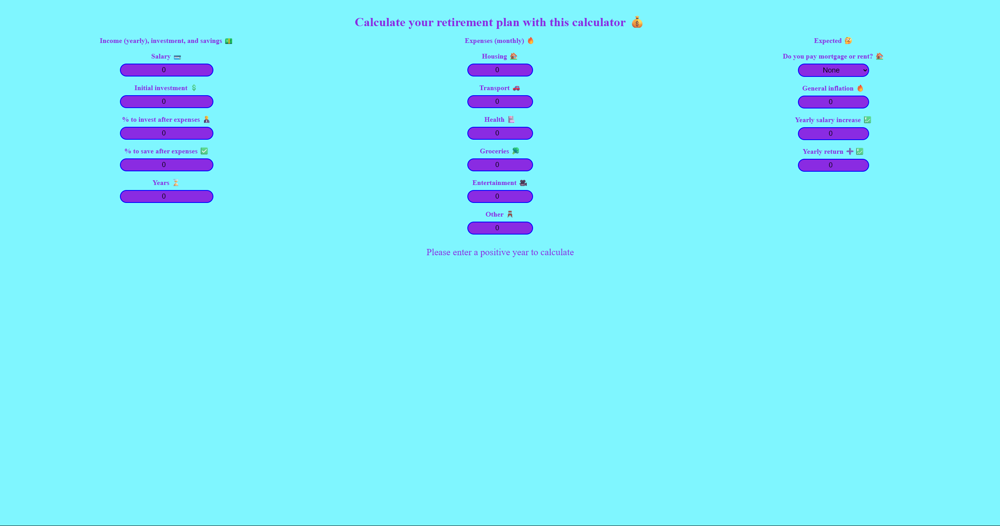
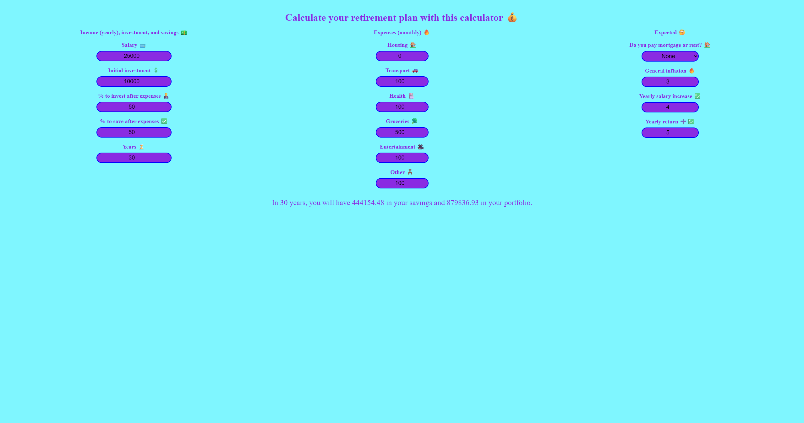
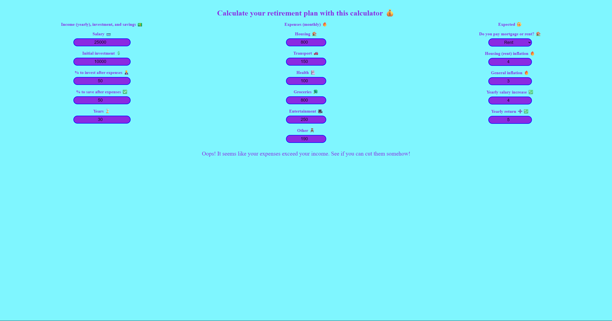

# Retirement Plan Calculator

A small, interactive React app (built with Vite) that helps you estimate savings and invested portfolio value over time based on income, expenses, savings rate, and expected returns. It’s designed for quick 'what-if' scenarios to better understand how current finances and assumptions affect long-term retirement outcomes.

## Table of Contents
- [Features](#features)
- [Installation](#installation)
- [Screenshots](#screenshots)
- [Scripts](#scripts)
- [License](#license)
- [Contributing](#contributing)
- [Author & Contact](#author--contact)

## Features
- **Interactive inputs:** Annual salary, initial investment, savings vs investment split, monthly expenses (housing, transport, health, groceries, entertainment, other), and expectations (inflation, salary increase, annual return).
- **Simple model:** Calculates cumulative savings and portfolio growth year-by-year using the provided percentages and rates.
- **Housing options:** Choose `none`, `mortgage`, or `rent` to model housing expenses and inflation/mortgage term.

## Installation

1. Clone the repository

```bash
git clone https://github.com/Sebastijan-Dominis/retirement-plan-calculator
```

2. Install dependencies:

```bash
npm install
```

3. Start the server:

```bash
npm run dev
```

4. Open the app at `http://localhost:5173` (Vite default).

## Screenshots







## Scripts
Available npm scripts (from `package.json`):

- `npm run dev` — Start Vite dev server
- `npm run build` — Build production bundle (runs TypeScript build first)
- `npm run preview` — Serve built production files locally
- `npm run lint` — Run ESLint checks

## Licence
- This project includes a `LICENSE` file in the repository root. Review it for licensing details.

## Contributing
- Feel free to open issues or PRs — small improvements, accessibility fixes, and more realistic financial models are welcome.

## Author & Contact
- Author: Sebastijan Dominis
- Contact: sebastijan.dominis99@gmail.com
